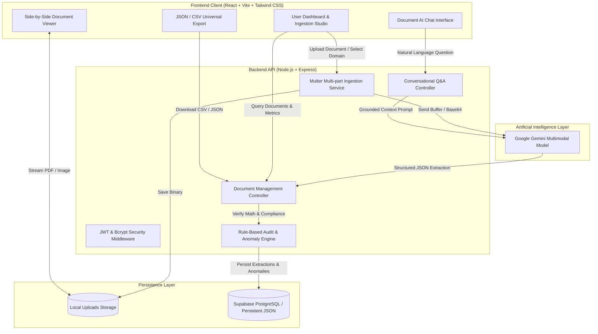

# 🌐 DocuSphere IDP — Multi-Domain Intelligent Document Processing & Audit Engine

[](https://nodejs.org/)
[](https://react.dev/)
[](https://tailwindcss.com/)
[](https://aistudio.google.com/)
[](https://opensource.org/licenses/MIT)

**DocuSphere IDP** is a production-grade, full-stack Intelligent Document Processing (IDP) and Compliance Auditing web application. Powered by **Google Gemini Multimodal Vision AI**, **Node.js/Express**, **React with Tailwind CSS**, and **Supabase PostgreSQL**, DocuSphere transforms unstructured documents (commercial invoices, expense receipts, clinical hospital claims, and vendor SLAs) into structured, audited, and actionable intelligence.

---

## 🌟 Key Capabilities & Innovations

1. **Multi-Domain Document Ingestion & Classification**:
   - Automated zero-shot classification across **Financial** (Invoices, Receipts, POs), **Healthcare** (Hospital UB-04 Claims, Clinical Summaries), and **Legal** (Enterprise SLAs, Master Agreements).
   - Drag-and-drop file ingestion supporting PDFs, PNG, JPG, and scans up to 25MB via Multer.
2. **Multimodal Zero-Shot Entity Extraction**:
   - Parses complex layouts directly into strongly-typed JSON structures: parties, addresses, tax IDs, dates, currency, and itemized line-items tables.
   - Extracts healthcare-specific entities: Patient MRN, Policy #, Attending Physician NPI, ICD-10 Diagnostic Codes, and CPT Procedure Codes.
3. **Automated Audit & Anomaly Detection Engine**:
   - **Mathematical Verification**: Automatically reconciles line-items sum ($\Sigma \text{items} = \text{Subtotal}$) and checks $\text{Subtotal} + \text{Tax} - \text{Discount} = \text{Total}$. Detects discrepancies down to the cent.
   - **Compliance & Risk Rules**: Detects overdue payment terms, missing tax IDs, and clinical prior-authorization flags.
4. **Interactive Side-by-Side Verification Studio**:
   - Split-screen layout: High-fidelity document viewer (zoom, rotate, preview) alongside parsed data tabs.
5. **Conversational Document AI (Interactive Q&A)**:
   - Natural language Q&A grounded strictly in the document content with citations.
6. **Universal Machine-Readable Export**:
   - One-click export to clean **JSON** and accounting-ready **CSV**.

---

## 🏗️ System Architecture & Data Flow



---

## 📁 Repository Structure

```
.
├── client/                     # Frontend Application (React, Vite, Tailwind CSS)
│   ├── public/
│   ├── src/
│   │   ├── components/         # StatusBadge, Navbar, UploadZone, DocumentViewer, etc.
│   │   ├── context/            # AuthContext (JWT session state & demo login)
│   │   ├── pages/              # Dashboard, DocumentDetail (Studio), Analytics, Login
│   │   ├── services/           # API client (Axios/Fetch wrapper)
│   │   ├── types/              # TypeScript definitions
│   │   ├── App.tsx             # React Router configuration
│   │   └── main.tsx
│   ├── package.json
│   ├── vite.config.ts          # Proxy configuration to backend (:5000)
│   └── tailwind.config.js
├── server/                     # Backend API (Node.js, Express, Gemini, Supabase)
│   ├── data/                   # Local persistent JSON fallback store (db.json)
│   ├── uploads/                # Ingested PDF & image files storage
│   ├── src/
│   │   ├── config/             # Gemini AI config, JWT config, auth helpers
│   │   ├── controllers/        # Auth, Document, Chat, Analytics controllers
│   │   ├── middleware/         # JWT Auth, Multer file filter & upload
│   │   ├── routes/             # authRoutes, documentRoutes, chatRoutes, analyticsRoutes
│   │   ├── services/           # geminiService, dbService, sampleDataService
│   │   ├── types/              # Document, ExtractedData, User types
│   │   └── index.ts            # Express server entry point
│   ├── .env.example            # Environment variables template
│   ├── package.json
│   └── tsconfig.json
├── docs/                       # Project Submission Artifacts
│   ├── PROBLEM_STATEMENT.md    # Detailed problem definition and solution specs
│   ├── DEMO_SCRIPT.md          # 3–5 minute presentation and video walkthrough script
│   └── API_REFERENCE.md        # Comprehensive REST API specifications
├── schema.sql                  # PostgreSQL & Supabase database schema
└── README.md                   # Master Documentation
```

---

## ⚡ Quick Start & Local Setup

### 1. Prerequisites
- **Node.js** (v18.x or v20.x+)
- **npm** or **yarn**

### 2. Backend Setup
```bash
cd server

# 1. Install dependencies
npm install

# 2. Configure environment variables
cp .env.example .env

# Edit .env with your Google Gemini API key:
# GEMINI_API_KEY=your_key_here

# 3. Start development server
npm run dev
```
*The server will boot on `http://localhost:5000` and automatically seed initial sample documents.*

### 3. Frontend Setup
```bash
cd client

# 1. Install dependencies
npm install

# 2. Start Vite dev server
npm run dev
```
*Open `http://localhost:5173` in your browser.*

---

## 🔑 Environment Variables Reference

### Backend (`server/.env`)
| Variable | Description | Default / Example |
| :--- | :--- | :--- |
| `PORT` | Backend server port | `5000` |
| `CLIENT_ORIGIN` | Allowed client origin for CORS | `http://localhost:5173` |
| `GEMINI_API_KEY` | Google Gemini API Key | Get free at [Google AI Studio](https://aistudio.google.com/) |
| `JWT_SECRET` | Secret key used to sign JWT auth tokens | `docusphere-super-secure-jwt-key` |
| `JWT_EXPIRES_IN` | Token duration | `7d` |
| `SUPABASE_URL` | *(Optional)* Supabase PostgreSQL URL | `https://your-project.supabase.co` |
| `SUPABASE_SECRET_KEY` | *(Optional)* Supabase Service Role Key | `sb_secret_...` |

> **Offline / Resilient Demo Mode**: If no `GEMINI_API_KEY` is provided, DocuSphere activates its deterministic high-fidelity IDP heuristic engine so that evaluators can test extractions, line-item tables, math checks, and chat without setup delays.

---

## 🚀 Deployment Guide

### Deploy Frontend (Vercel / Netlify)
1. Push your repository to GitHub.
2. Link the repository on **Vercel** or **Netlify**.
3. Set the **Root Directory** to `client`.
4. Build Command: `npm run build`
5. Output Directory: `dist`
6. Add environment variable: `VITE_API_URL=https://your-backend-app.onrender.com`

### Deploy Backend (Render / Railway)
1. In **Render** or **Railway**, create a new Web Service pointing to your repository.
2. Set the **Root Directory** to `server`.
3. Build Command: `npm install && npm run build`
4. Start Command: `npm run start`
5. Add the environment variables from `server/.env.example` (especially `GEMINI_API_KEY` and `JWT_SECRET`).

---

## 🧪 Testing & Verification

1. **Instant Demo Datasets**: On the dashboard, click **"Load for Testing"** under *Commercial Invoice*, *Hospital UB-04 Claim*, or *Master Cloud SLA*.
2. **Inspect Studio**: Click the Eye icon on any row in the ledger to enter the side-by-side verification studio.
3. **Verify Math Discrepancy**: Switch to the **Audit & Anomalies** tab on the Invoice to view the automatic subtotal reconciliation calculation.
4. **Contextual Chat**: Switch to the **Document AI Chat** tab and ask:
   - *"What is the total amount and payment terms?"*
   - *"Explain the line items breakdown."*
   - *"What is the primary clinical diagnosis?"*
5. **Universal Export**: Download clean CSV and JSON directly from the studio.

---

## 📄 Submission Documents
- [Problem Statement & Architecture](file:///docs/PROBLEM_STATEMENT.md)
- [3–5 Minute Video Walkthrough Script](file:///docs/DEMO_SCRIPT.md)
- [REST API Reference](file:///docs/API_REFERENCE.md)
- [Database Schema (SQL)](file:///schema.sql)
